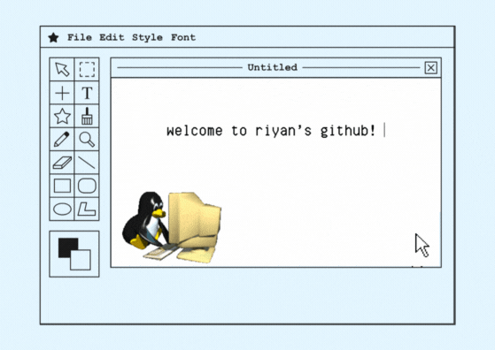

<!-- Banner GIF -->

  

# 👋 𝚑𝚒 𝚝𝚑𝚎𝚛𝚎!

𝚒'𝚖 𝚛𝚒𝚢𝚊𝚗, 𝚊 𝚙𝚊𝚜𝚜𝚒𝚘𝚗𝚊𝚝𝚎 𝚍𝚎𝚟𝚎𝚕𝚘𝚙𝚎𝚛, 𝚝𝚎𝚌𝚑 𝚎𝚗𝚝𝚑𝚞𝚜𝚒𝚊𝚜𝚝, 𝚊𝚗𝚍 𝚕𝚒𝚏𝚎𝚕𝚘𝚗𝚐 𝚕𝚎𝚊𝚛𝚗𝚎𝚛. 𝚒 𝚕𝚘𝚟𝚎 𝚋𝚞𝚒𝚕𝚍𝚒𝚗𝚐 𝚌𝚘𝚘𝚕 𝚝𝚑𝚒𝚗𝚐𝚜, 𝚜𝚘𝚕𝚟𝚒𝚗𝚐 𝚒𝚗𝚝𝚎𝚛𝚎𝚜𝚝𝚒𝚗𝚐 𝚙𝚛𝚘𝚋𝚕𝚎𝚖𝚜, 𝚊𝚗𝚍 𝚌𝚘𝚕𝚕𝚊𝚋𝚘𝚛𝚊𝚝𝚒𝚗𝚐 🚀.

💻 𝚒’𝚖 𝚌𝚞𝚛𝚛𝚎𝚗𝚝𝚕𝚢 𝚠𝚘𝚛𝚔𝚒𝚗𝚐 𝚘𝚗: valuation platform for enthusiast vehicles

📚 𝚕𝚎𝚊𝚛𝚗𝚒𝚗𝚐 𝚊𝚋𝚘𝚞𝚝: fastapi

🛠️ 𝚝𝚎𝚌𝚑𝚗𝚘𝚕𝚘𝚐𝚒𝚎𝚜: 𝚓𝚊𝚟𝚊, 𝚙𝚢𝚝𝚑𝚘𝚗, 𝚗𝚎𝚡𝚝.𝚓𝚜, 𝚖𝚘𝚗𝚐𝚘𝚍𝚋, 𝚒𝚗𝚝𝚎𝚕𝚕𝚒𝚓, 𝚟𝚒𝚜𝚞𝚊𝚕 𝚜𝚝𝚞𝚍𝚒𝚘 𝚌𝚘𝚍𝚎

---

## 🔗 c𝚘𝚗𝚗𝚎𝚌𝚝 𝚠𝚒𝚝𝚑 𝚖𝚎!

<!-- Add more links as needed -->
<!-- - [Portfolio](https://yourportfolio.com) -->
<!-- - [Twitter](https://twitter.com/yourhandle) -->

---

t𝚑𝚊𝚗𝚔𝚜 𝚏𝚘𝚛 𝚜𝚝𝚘𝚙𝚙𝚒𝚗𝚐 𝚋𝚢! 😊  
⭐️ f𝚎𝚎𝚕 𝚏𝚛𝚎𝚎 𝚝𝚘 𝚌𝚑𝚎𝚌𝚔 𝚘𝚞𝚝 𝚖𝚢 𝚛𝚎𝚙𝚘𝚜𝚒𝚝𝚘𝚛𝚒𝚎𝚜 𝚊𝚗𝚍 𝚕𝚎𝚊𝚟𝚎 𝚊 𝚜𝚝𝚊𝚛 𝚒𝚏 𝚢𝚘𝚞 𝚏𝚒𝚗𝚍 𝚜𝚘𝚖𝚎𝚝𝚑𝚒𝚗𝚐 𝚒𝚗𝚝𝚎𝚛𝚎𝚜𝚝𝚒𝚗𝚐!
